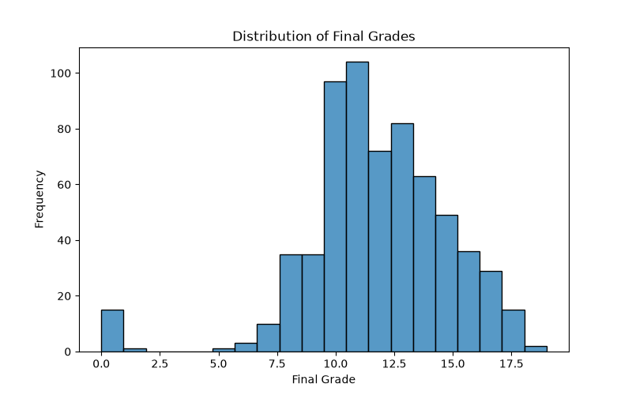
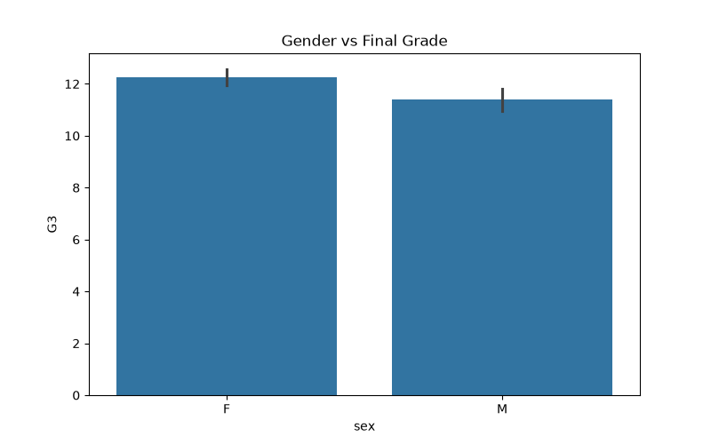
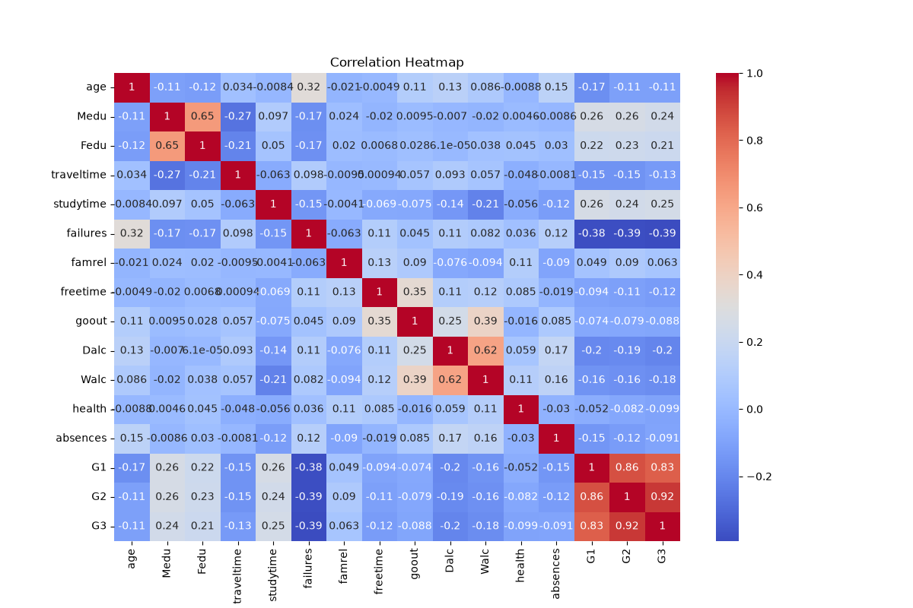

# student-performance-eda


<div align="center">

# 📊 Exploratory Data Analysis of Student Academic Performance

### Uncovering Patterns, Trends, and Insights from Educational Data


<br>

### 🔍 Turning Raw Educational Data into Actionable Insights

</div>

---

# 📑 Table of Contents

- [📌 Project Overview](#-project-overview)
- [🎯 Objectives](#-objectives)
- [📂 Dataset Information](#-dataset-information)
- [🛠️ Technology Stack](#️-technology-stack)
- [📊 Statistical Summary](#-statistical-summary)
- [📈 Visual Analysis](#-visual-analysis)
- [🔥 Key Findings](#-key-findings)
- [📁 Repository Structure](#-repository-structure)
- [🚀 Future Scope](#-future-scope)
- [👨‍💻 Author](#-author)

---

# 📌 Project Overview

This project performs **Exploratory Data Analysis (EDA)** on the Student Performance Dataset to identify hidden patterns, trends, relationships, and factors affecting academic performance.

The analysis combines:

✅ Statistical Summaries

✅ Data Visualization

✅ Correlation Analysis

✅ Insight Extraction

✅ Educational Performance Analytics

The goal is to transform raw data into meaningful insights that can support educational decision-making and student success strategies.

---

# 🎯 Objectives

### Primary Goals

- Analyze student academic performance data.
- Identify factors influencing final grades.
- Explore relationships among academic and demographic attributes.
- Visualize patterns using professional charts.
- Generate actionable insights from data.

---

# 📂 Dataset Information

| Property | Value |
|-----------|---------|
| Dataset | Student Performance Dataset |
| Total Records | 649 |
| Total Features | 33 |
| Domain | Education Analytics |
| Target Indicator | G3 (Final Grade) |

---

# 🛠️ Technology Stack

| Category | Technology |
|-----------|-------------|
| Programming Language | Python 🐍 |
| Data Analysis | Pandas 🐼 |
| Visualization | Matplotlib 📈 |
| Statistical Visualization | Seaborn 🎨 |
| Dataset | Student Performance Dataset 📚 |

---

# 📊 Statistical Summary

## Dataset Overview

| Metric | Value |
|----------|---------|
| Records | 649 |
| Features | 33 |
| Average Age | 16.74 Years |
| Average Final Grade (G3) | 11.91 |
| Median Grade (G3) | 12 |
| Maximum Grade | 19 |
| Minimum Grade | 0 |

### Key Observation

Most students achieved moderate academic performance, with grades concentrated around the average range.

---

# 🔄 EDA Workflow

```text
Dataset Collection
        ↓
Data Understanding
        ↓
Statistical Summary
        ↓
Visualization
        ↓
Correlation Analysis
        ↓
Pattern Discovery
        ↓
Insight Generation
        ↓
Conclusion
```

---

# 📈 Visual Analysis

---

## 📊 Grade Distribution Analysis

### Visualization



### Observation

- Most students scored between **10 and 15 marks**.
- Distribution is approximately bell-shaped.
- Very few students achieved extremely low or extremely high grades.

### Insight

Academic performance is concentrated around average to above-average grades.

---

## 📚 Study Time vs Final Grade

### Visualization


### Observation

- Students with higher study time levels generally achieved better grades.
- Study time categories 3 and 4 demonstrated higher median scores.

### Insight

Increased study effort positively influences academic performance.

---

## 🎯 Absences vs Final Grade

### Visualization


### Observation

- Students with fewer absences tend to perform better academically.
- High absenteeism is associated with lower grades.

### Insight

Attendance plays a significant role in student success.

---

## 👩‍🎓 Gender vs Final Grade

### Visualization



### Observation

- Female students achieved slightly higher average grades.
- The difference is noticeable but not extremely large.

### Insight

Gender shows a small influence on academic performance within this dataset.

---

## 🔥 Correlation Heatmap

### Visualization



### Strongest Correlations

| Variables | Correlation |
|------------|------------|
| G2 ↔ G3 | 0.92 |
| G1 ↔ G2 | 0.86 |
| G1 ↔ G3 | 0.83 |

### Insight

Previous academic performance is the strongest predictor of future academic outcomes.

---

# 🔍 Key Findings

## Positive Influencers

✅ Higher Study Time

✅ Strong Previous Grades (G1 & G2)

✅ Consistent Attendance

---

## Negative Influencers

❌ Academic Failures

❌ Excessive Absenteeism

❌ Higher Alcohol Consumption

---

## Major Discovery

> Previous grades (G1 and G2) show the strongest relationship with final academic performance (G3), making them the most influential factors in the dataset.

---

# 📊 Summary Dashboard

| Factor | Impact on Performance |
|----------|----------------------|
| Study Time | Positive 📈 |
| Previous Grades | Strong Positive 🚀 |
| Attendance | Positive ✅ |
| Failures | Negative ❌ |
| Alcohol Consumption | Slight Negative ⚠️ |
| Gender | Minor Influence 📊 |

---

# 📁 Repository Structure

```text
student-performance-eda/

├── student_eda.py
├── student-por.csv

├── Grade_Distribution.png
├── Studytime_vs_Grade.png
├── Absences_vs_Grade.png
├── Gender_vs_Grade.png
├── Correlation_Heatmap.png

├── EDA_Report.pdf
├── EDA_Presentation.pptx

├── README.md
├── LICENSE
└── .gitignore
```

---

# 🚀 Future Scope

### Potential Enhancements

- 📊 Interactive Dashboards (Power BI / Tableau)
- 🤖 Predictive Analytics using Machine Learning
- 📈 Student Risk Assessment Models
- 🎯 Educational Recommendation Systems
- ☁️ Cloud-Based Data Analytics Pipelines

---

# 🎓 Learning Outcomes

Through this project, the following skills were developed:

- Data Exploration
- Statistical Analysis
- Data Visualization
- Correlation Analysis
- Analytical Thinking
- Insight Generation
- Report Writing

---

# 👨‍💻 Author

## Ansh Franky Gaming

### Data Science • Analytics • Machine Learning Enthusiast

Built as part of an academic Data Science and Exploratory Data Analysis project.

---

<div align="center">

## ⭐ If you found this project useful, consider giving it a Star!

### 📊 Data tells a story — EDA helps us understand it.

</div>
Exploratory Data Analysis (EDA) of student academic performance using Python, Pandas, Matplotlib, and Seaborn. Includes statistical summaries, correlation analysis, visualizations, and insights.
